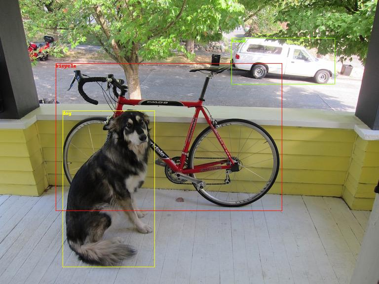

# Pytorch-YOLOv4

A minimal PyTorch implementation of YOLOv4.
- Paper Yolo v4: https://arxiv.org/abs/2004.10934
- Source code:https://github.com/AlexeyAB/darknet
- More details: http://pjreddie.com/darknet/yolo/




# Inference
- download model weight https://drive.google.com/open?id=1cewMfusmPjYWbrnuJRuKhPMwRe_b9PaT
```
python demo.py cfgfile weightfile imgfile
```

- [x] Convolution weight reshape
- [x] Mish activation
- [x] route number > 2
- [x] Maxpooling
- [ ] yololayer

Reference:
- https://github.com/eriklindernoren/PyTorch-YOLOv3
- https://github.com/marvis/pytorch-caffe-darknet-convert
- https://github.com/marvis/pytorch-yolo3

```
@article{yolov4,
  title={YOLOv4: YOLOv4: Optimal Speed and Accuracy of Object Detection},
  author={Alexey Bochkovskiy, Chien-Yao Wang, Hong-Yuan Mark Liao},
  journal = {arXiv},
  year={2020}
}
```